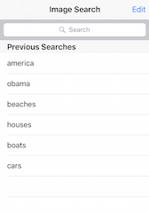

# TNMImageSearch

##Overview
A demo iOS app that searches against Google's Image Search API.  Written with no external libraries and uses Storyboards and Auto Layout.

Includes:

* Image search
* Saved search results with filtering
* 3 column image results
* Loading indicators
* Image zoom
* Image caching
* Error handling
* Orientation support

##Screenshots

